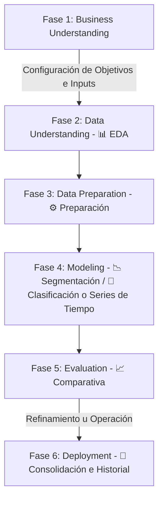

# ⛏️ Minería de Datos — Sistema CRISP-DM Completo

Este repositorio contiene una aplicación web interactiva profesional diseñada para guiar a analistas, científicos de datos y tomadores de decisiones a través del ciclo completo de minería de datos estructurado bajo la metodología internacional **CRISP-DM** (CRoss Industry Standard Process for Data Mining).

La plataforma está desarrollada en **Python 3.12** utilizando **Streamlit** para la interfaz de usuario interactiva y **Scikit-Learn**, **XGBoost**, **LightGBM**, y **Statsmodels** para el modelado matemático robusto.

---

## 📋 Tabla de Contenidos
1. [Requisitos del Sistema e Instalación](#-requisitos-del-sistema-e-instalación)
2. [Librerías y Versiones Utilizadas](#-librerías-y-versiones-utilizadas)
3. [Mapeo de la Metodología CRISP-DM](#-mapeo-de-la-metodología-crisp-dm)
4. [Manual de Usuario por Módulo](#-manual-de-usuario-por-módulo)
5. [Modelos Implementados y Parámetros](#-modelos-implementados-y-parámetros)
6. [Protecciones de Calidad del Modelo (Anti-Leakage & Overfitting)](#-protecciones-de-calidad-del-modelo-anti-leakage--overfitting)
7. [Guía Rápida de Ejecución](#-guía-rápida-de-ejecución)

---

## 💻 Requisitos del Sistema e Instalación

### Requisitos Previos
- **Python**: Versión `3.12.x` recomendada.
- **Sistema Operativo**: Windows, macOS o distribuciones de Linux.

### Instalación
1. Clona este repositorio o descarga los archivos en tu máquina local:
   ```bash
   git clone <URL_DEL_REPOSITORIO>
   cd <CARPETA_DEL_PROYECTO>
   ```

2. Se recomienda crear y activar un entorno virtual para aislar las dependencias:
   ```bash
   # En Windows
   python -m venv venv
   .\venv\Scripts\activate

   # En macOS/Linux
   python3 -m venv venv
   source venv/bin/activate
   ```

3. Instala los paquetes requeridos utilizando `pip`:
   ```bash
   pip install -r requirements.txt
   ```
   *(Si no existe un archivo `requirements.txt`, puedes crearlo con las dependencias listadas en la siguiente sección o ejecutar directamente la instalación de dependencias clave)*:
   ```bash
   pip install streamlit pandas numpy scikit-learn scipy plotly xgboost lightgbm statsmodels pmdarima openpyxl
   ```

---

## 📦 Librerías y Versiones Utilizadas

El sistema ha sido verificado y está optimizado bajo las siguientes versiones exactas del entorno de ejecución:

| Librería | Versión | Descripción / Propósito |
| :--- | :--- | :--- |
| **`python`** | `3.12.9` | Entorno base del intérprete de comandos |
| **`streamlit`** | `1.56.0` | Framework web interactivo para la UI |
| **`pandas`** | `3.0.1` | Carga, limpieza y manipulación estructural de datos |
| **`numpy`** | `2.4.4` | Cálculos matriciales y procesamiento numérico rápido |
| **`scikit-learn`** | `1.8.0` | Pipeline de preparación (Imputer, Scaler, Encoders), métricas y modelos tradicionales |
| **`scipy`** | `1.17.1` | Cálculos de clustering jerárquico (dendrogramas) |
| **`plotly`** | `6.6.0` | Gráficos y matrices interactivas y responsivas |
| **`xgboost`** | `3.2.0` | Algoritmo de ensamble Gradient Boosting de alto desempeño |
| **`lightgbm`** | `4.6.0` | Gradient Boosting optimizado para velocidad y eficiencia de memoria |
| **`statsmodels`** | `0.14.6` | Modelo Holt-Winters para Suavizado Exponencial de series temporales |
| **`pmdarima`** | `2.1.1` | Wrapper para algoritmos ARIMA automatizados (AutoARIMA) |
| **`openpyxl`** | `3.1.5` | Motor de lectura para hojas de cálculo de Microsoft Excel (.xlsx) |

---

## 🗺️ Mapeo de la Metodología CRISP-DM

La aplicación estructura de forma lógica el progreso analítico a través de las fases de CRISP-DM:



1. **Fase 1: Business Understanding**: Definida por el usuario al cargar sus datos en la barra lateral y seleccionar la variable objetivo (`target`) a predecir o analizar.
2. **Fase 2: Data Understanding (Pestaña 📊 EDA)**: Análisis exploratorio automatizado de tipos de datos, distribución de variables, matrices de correlación y análisis bivariado interactivo.
3. **Fase 3: Data Preparation (Pestaña ⚙️ Preparación)**: Limpieza de duplicados y nulos, codificación robusta de variables cualitativas, escalado y división limpia en tres subconjuntos (Entrenamiento, Validación y Prueba).
4. **Fase 4: Modeling (Pestaña 📉 Segmentación / Pestaña 🌳 Clasificación o 📈 Series de Tiempo)**:
   - **Segmentación**: Modelado no supervisado para agrupar clientes o registros (K-Means y Jerárquico).
   - **Clasificación**: Entrenamiento de 7 algoritmos diferentes con ajuste de hiperparámetros.
   - **Series de Tiempo**: Si se configura una columna de tiempo, se activan Holt-Winters y AutoARIMA con corte cronológico y predicciones futuras.
5. **Fase 5: Evaluation (Pestaña 📈 Comparativa)**: Visualización y contraste riguroso del desempeño de todos los modelos entrenados mediante tablas ordenadas de métricas clave y curvas ROC multiclase superpuestas.

---

## 📖 Manual de Usuario por Módulo

### 1. Barra Lateral: Carga y Configuración General
- **Cargar Dataset**: Haz clic en "Browse files" y sube tu archivo (CSV, TSV, XLSX, JSON o Parquet). El sistema identificará automáticamente los separadores y el tipo de archivo.
- **Variable Objetivo (Target)**: Selecciona la columna que deseas predecir.
- **Exclusión Manual**: Selecciona variables que identifiques que no deben ir en el modelo.
- **Columna de Tiempo (Opcional)**: Si deseas trabajar con **Series de Tiempo**, selecciona aquí tu columna temporal. Esto desactivará el flujo de clasificación normal y encenderá las particiones estrictamente cronológicas.
- **Esquema de Partición**: Escoge la distribución de tus datos (`80/20`, `70/15/15`, etc.).
- **Botón Analizar y Preparar**: Inicializa el motor de procesamiento analítico y desbloquea el resto de fases.

### 2. Módulo: 📊 EDA (Data Understanding)
- **Perfil de Variables**: Muestra estadísticas descriptivas completas por variable.
- **Distribución de Target**: Gráfico interactivo que muestra el balance de clases.
- **Matriz de Correlación**: Mapa de calor dinámico para identificar correlaciones lineales fuertes (Pearson) y advertir sobre colinealidad.
- **Análisis Bivariado**: Cruza de forma interactiva cualquier feature numérica o categórica contra el Target seleccionado.

### 3. Módulo: ⚙️ Preparación (Data Preparation)
- **Auditoría del Proceso**: Registra de forma transparente la remoción de registros duplicados, imputaciones realizadas (mediana para numéricas, moda para categóricas) y los nombres de las clases codificadas.
- **Data Baseline**: Muestra estadísticas resumidas de los splits de datos resultantes (`Train`, `Validation`, `Test`) garantizando que los conjuntos mantengan consistencia estructural.

### 4. Módulo: 📉 Segmentación (Modeling No Supervisado)
- **K-Means Clustering**: Configura el número de clusters ($k$) mediante un slider y evalúa el coeficiente de silueta (*Silhouette Score*).
- **Clustering Jerárquico**: Genera y grafica un Dendrograma interactivo utilizando el método de enlace *Ward* para visualizar la similitud natural de los grupos.
- **Reducción de Dimensionalidad (PCA)**: Grafica en 2D el agrupamiento del espacio multidimensional mediante componentes principales.

### 5. Módulo: 🌳 Clasificación o 📈 Series de Tiempo (Modeling Supervisado)
- **Clasificación**: Entrena y optimiza 7 modelos en pestañas independientes (Árbol, Random Forest, Regresión Logística, KNN, Naive Bayes, XGBoost y LightGBM). Podrás ajustar hiperparámetros de regularización como `max_depth` o `min_samples_leaf` para evitar el sobreajuste.
- **Series de Tiempo**: Si activaste la opción temporal en el sidebar, entrena **Suavizado Exponencial** o **AutoARIMA**. El gráfico interactivo te mostrará la predicción sobre el conjunto de test y proyectará **30 pasos de tiempo adicionales hacia el futuro** de forma gráfica.

### 6. Módulo: 📈 Comparativa (Evaluation)
- **Tabla de Clasificación General**: Ordena automáticamente tus modelos de mayor a menor según el indicador de negocio que elijas (Accuracy, Precision, Recall, F1-Score, AUC-ROC).
- **Gráfico de Curvas ROC**: Superpone las curvas ROC de todos tus modelos entrenados para evaluar la tasa de Verdaderos Positivos frente a Falsos Positivos de forma visual y unificada.

---

## 🤖 Modelos Implementados y Parámetros

El sistema cuenta con un catálogo de algoritmos de última generación:

### Modelos de Clasificación
- **Árbol de Decisión**: Clasificador CART de Scikit-Learn. Parámetros: Profundidad máxima (`max_depth`) y muestras mínimas en hoja (`min_samples_leaf`).
- **Random Forest**: Ensamble mediante *Bagging*. Parámetros: Número de estimadores (`n_estimators`), `max_depth` y `min_samples_leaf`.
- **Regresión Logística**: Modelo lineal regularizado. Parámetros: Coeficiente de regularización L2 (`C`) y número de iteraciones máximas (`max_iter`).
- **K-Nearest Neighbors (KNN)**: Clasificador por vecindario métrico. Parámetro: Número de vecinos (`n_neighbors`).
- **Naive Bayes**: Clasificador probabilístico GaussianNB. Rápido, no requiere hiperparámetros complejos.
- **XGBoost**: Ensamble mediante *Boosting* con manejo optimizado de pesos de clase. Parámetros: `n_estimators`, `max_depth` y tasa de aprendizaje (`learning_rate`).
- **LightGBM**: Ensamble leaf-wise optimizado para conjuntos de datos grandes. Parámetros: `n_estimators`, `max_depth` y `learning_rate`.

### Modelos de Series de Tiempo
- **Holt-Winters (Suavizado Exponencial)**: Ajusta componentes de Tendencia (Aditiva/Multiplicativa), Estacionalidad y periodos estacionales.
- **AutoARIMA**: Optimiza matemáticamente los parámetros autorregresivos, integrados y de medias móviles $(p, d, q) \times (P, D, Q)_m$ para el mejor ajuste automático AIC/BIC.

---

## 🛡️ Protecciones de Calidad del Modelo (Anti-Leakage & Overfitting)

Para garantizar que los modelos entrenados tengan una validez científica real y no sufran de sobreajuste o fugas de información, el sistema tiene implementadas 3 capas estrictas de seguridad de datos:

1. **Detección Automática de Data Leakage**:
   Durante la fase de preparación, el sistema entrena un evaluador preliminar sobre todas las variables. Si alguna variable numérica o categórica predice al target con un **AUC-ROC o coeficiente de correlación superior a 0.95**, el sistema la marca inmediatamente como una variable **Post-Evento (Leakage)** y sugiere su exclusión automática para evitar la memorización artificial del modelo.
2. **Transformadores Ajustados únicamente en Train**:
   Para evitar que la media, la desviación estándar o los mapeos de categorías del conjunto de prueba influyan en el entrenamiento, **todas** las transformaciones (`StandardScaler`, `SimpleImputer`, `LabelEncoder`) ejecutan el método `.fit()` **exclusivamente con los datos de entrenamiento (Train)**, aplicando únicamente `.transform()` sobre validación y prueba.
3. **Control y Alerta de Overfitting**:
   Al entrenar un clasificador, se calcula la diferencia (*Gap*) de Accuracy entre el conjunto de Train y Test. Si la diferencia es **mayor al 15%** (`gap > 0.15`), el sistema emite una advertencia interactiva en pantalla informando que el modelo presenta **sobreajuste significativo** y recomienda ajustar los parámetros de regularización en los sliders de la interfaz.

---

## 🚀 Guía Rápida de Ejecución

Una vez que tengas el entorno virtual activado y las dependencias instaladas, ejecuta el panel interactivo en tu navegador con el siguiente comando:

```bash
streamlit run app.py
```

El servidor local se iniciará y se abrirá automáticamente en tu navegador predeterminado (usualmente en la dirección `http://localhost:8501`).

---
Desarrollado como una herramienta profesional para la aplicación sistemática y auditable de la metodología **CRISP-DM**. ¡Listo para producción y despliegue científico! ⛏️
